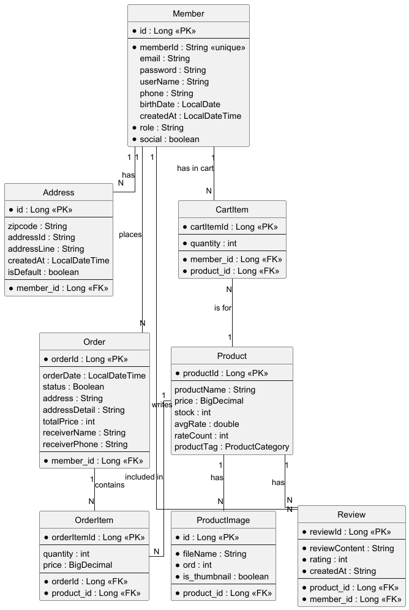
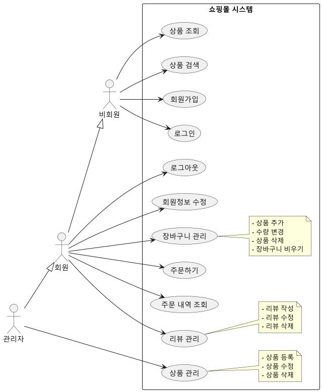
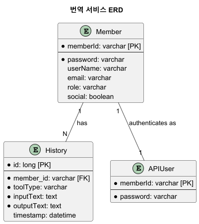
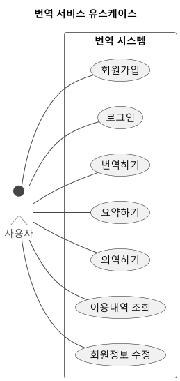
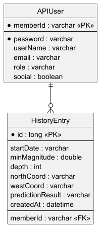
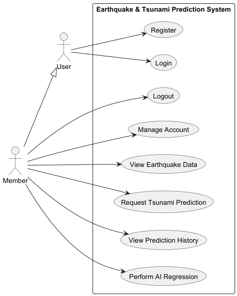

# 🧑‍💻 끈기있고 기죽지 않는 개발자 민주현의 포트폴리오

| 연락처/정보 | 내용 |
| :--- | :--- |
| **연락처** | 010-9453-2254 |
| **이메일** | minjoohyun67@naver.com |
| **주소** | 부산 금정구 금샘로 |
| **개발 철학** | 매일 매일 더 좋은 사람이 되기 위해 노력하는 사람. |

---

## 🛠️ SKILL STACK
### 백엔드 (Backend)
* **Java (Core, OOP):** 객체 지향 원리를 적용한 Java 프로그래밍
* **Spring Boot:** Spring의 핵심 원리(IoC/DI)를 적용한 웹 애플리케이션 구축
* **RESTful API (JSON):** JSON 형식을 이용한 RESTful API 설계 및 구축
* **Spring Security & JWT:** 토큰 기반의 보안 인증/인가 시스템 구현
* **JPA (ORM) & Querydsl:** ORM 및 동적 쿼리를 활용한 효율적인 데이터 처리
* **MyBatis:** SQL Mapper를 이용한 안정적인 데이터베이스 연동

### 데이터 사이언스 & AI
* **Python:** 데이터 분석 및 AI 모델링을 위한 Python 활용
* **환경 구성:** Anaconda, Jupyter Notebook을 통한 데이터 분석 및 모델링 실험 환경 구성
* **데이터 수집 (ETL):** Selenium, BeautifulSoup을 활용한 웹 크롤링
* **데이터 분석:** Pandas, Numpy를 사용한 데이터 전처리, 정제 및 탐색적 데이터 분석(EDA)
* **머신러닝:** Scikit-learn을 이용한 머신러닝(회귀, 분류, 군집) 모델 개발 및 평가
* **딥러닝:** TensorFlow, Keras를 이용한 딥러닝(ANN, CNN, RNN) 모델링

### 프론트엔드 (Frontend)
* **JavaScript:** 비동기 처리(Async) 및 DOM 제어
* **React:** CRA 기반의 SPA(단일 페이지 애플리케이션) 개발
* **HTML 5 & CSS3:** 시맨틱 마크업 및 Flex/Box Model 기반 레이아웃
* **라이브러리:** jQuery, Axios를 이용한 Ajax 통신 및 HTTP 클라이언트 라이브러리 활용
* **반응형 웹:** Bootstrap을 활용한 반응형 웹 디자인 적용

### 데이터베이스 (Database)
* **RDBMS:** MySQL, MariaDB, Oracle을 통한 모델링, 설계 및 구축
* **SQL:** 복잡한 쿼리(JOIN, Subquery) 및 트랜잭션 관리(DDL, DML, DCL)
* **NoSQL:** MongoDB를 이용한 Document (BSON) 모델 기반 데이터 처리 및 조회

### 협업 및 도구
* **형상 관리:** Git을 이용한 형상 관리 및 Github 기반 원격 협업
* **IDE:** IntelliJ, WebStorm, PyCharm 등 프로젝트 목적에 맞는 다양한 IDE 활용
* **빌드 도구:** Maven, Gradle을 통한 라이브러리 의존성 관리 및 프로젝트 빌드
* **앱 개발:** Flutter, Dart를 이용한 크로스 플랫폼 모바일 앱 개발 (Widget 개념 이해 및 앱 빌드)

---

## 📚 PROJECT EXPERIENCE

| 프로젝트 기간 | 프로젝트명 | Backend Repository | Frontend Repository | Python Repository |
| :--- | :--- | :--- | :--- | :--- |
| 2025.07.18~2025.08.04 | **WebShopping Project** | [Link](https://github.com/minjuhyun1999/ShoppingWeb_Project/tree/develop) | - | - |
| 2025.08.21~2025.08.29 | **T.S.P Project** | [Link](https://github.com/minjuhyun1999/TranslationProject/tree/develop) | [Link](https://github.com/minjuhyun1999/TranslationProject_Front/tree/develop) | - |
| 2025.10.20~2025.11.13 | **AI 기반 실시간 쓰나미 예측 및 시뮬레이터** | [Link](https://github.com/minjuhyun1999/team_project_back/tree/develop) | [Link](https://github.com/minjuhyun1999/team_project_front/tree/develop) | [Link](https://github.com/minjuhyun1999/team_project_python/tree/develop) |

### 1. WebShopping Project

* **개요:** Spring Boot 기반의 웹 쇼핑몰로, 회원 관리부터 상품 검색, 주문, 리뷰에 이르는 전자상거래 핵심 기능 구현. Controller-Service-Repository의 계층형 아키텍처 적용.
* **개발 환경:** SpringBoot, Spring Data JPA, Spring Security, MariaDB, TomCat, HTML, CSS, JS, Git/Github, IntelliJ IDEA.
* **개발 인원 및 기간:** 5명, 2025.07.18 ~ 2025.08.04.

#### 📐 시스템 구조 및 화면
| 다이어그램 | 스크린샷 |
| :---: | :---: |
| **ERD (Entity Relationship Diagram)** | **홈페이지 및 상품 목록** |
|  |  |
| **USECASE Diagram** | **상품 관리 (이미지 업로드/등록)** |
|  |  |

#### 주요 구현 기능 및 코드 설명
1.  **이미지 업로드 및 관리:**
    * **기능 시각화:** 
    * `@Value`를 이용한 업로드 경로 외부 설정 및 관리.
    * `MultipartFile`을 이용한 파일 업로드 처리 및 `UUID`를 활용한 고유 파일명 생성.
    * `file.transferTo()`를 이용한 파일 시스템 저장 및 JPA 엔티티를 통한 DB 연동.
    * `FileSystem Resource` 및 `HttpHeaders`를 이용한 이미지 동적 서빙 (경로 탐색 공격 방지 포함).
2.  **장바구니 기능 (수량 조절 및 알림):**
    * **기능 시각화 (알림 / 동적 관리):** 
    * `Fetch API`를 통해 `POST /api/cart`로 상품을 추가하고 `JavaScript alert()` 함수로 성공 알림 제공.
    * `RESTful API`를 활용한 장바구니 항목 동적 관리 시스템 구축 (`PATCH /api/cart/{productID}`로 수량 증감, 재고 부족 시 백엔드 처리).
3.  **상품 재고 관리 및 구매 제한 (품절 표시):**
    * **기능 시각화 (품절 표시):** 
    * **백엔드:** `ProductDTO`의 `stock` 필드로 재고 정보 제공.
    * **프론트엔드:** `product.stock <= 0` 조건으로 재고 확인 후 “품절” 텍스트 동적 추가 및 ‘장바구니 담기' 버튼 `disabled` 처리.

***

### 2. T.S.P Project (번역 서비스)

* **핵심 기술력:** Google 번역 API 연동 및 Spring Security/JWT 활용 등 서비스 통합과 인증 시스템 구축 능력을 잘 보여줌.

#### 📐 시스템 구조 및 다이어그램

    <table>
        <tr>
            <td width="50%" align="center">
                
                 
                **[그림 2-1] T.S.P 프로젝트 ERD**
            </td>
            <td width="50%" align="center">
                
                 
                **[그림 2-2] T.S.P 프로젝트 Use Case**
            </td>
        </tr>
    </table>

#### 🖥️ 주요 화면 및 컴포넌트 (4분할 구조)

| 메인 번역 화면 | 마이페이지 | 네비게이션 바 (로그인/로그아웃 상태) | 상세 번역 결과 |
| :---: | :---: | :---: | :---: |
|  |  |  |  |

* **프론트엔드 (React):** 기술 스택: React, `react-router-dom`, `react-icons`. 주요 기능: 반응형 디자인, Flexbox 기반 레이아웃, 시맨틱 마크업, 동적 UI 확장성.
* **인증 시스템 연동 (MyPage & UserNav):** `AuthContext`를 활용한 `UserNav` 및 `MyPage` 컴포넌트 구현. `useAuth` 훅을 사용해 로그인된 사용자의 정보를 안전하게 가져와 표시하고, `apiClient`를 사용해 백엔드 API와 안전하게 통신.

***

### 3. AI 기반 실시간 쓰나미 예측 및 시뮬레이터 (기능 구현 강조)

#### 📐 시스템 구조 및 다이어그램

    <table>
        <tr>
            <td width="50%" align="center">
                
                 
                **[그림 3-1] AI 쓰나미 예측 시스템 ERD**
            </td>
            <td width="50%" align="center">
                
                 
                **[그림 3-2] AI 쓰나미 예측 시스템 Use Case**
            </td>
        </tr>
    </table>

#### 🛠️ 핵심 기능 구현 상세

##### 1. 안전한 사용자 인증 시스템 (Spring Security / JWT)
* **구현 상세:** Spring Boot와 Spring Security 기반의 RESTful API에 대한 **안전한 인증 시스템** 구축. **상태 비저장(Stateless) 세션 관리 모델**을 채택하여 확장성을 확보했으며, **JSON Web Token (JWT)**을 사용하여 사용자의 인증 상태를 안전하게 관리합니다.
* **관련 화면:**
    | 로그인 화면 | 회원가입 화면 |
    | :---: | :---: |
    |  |  |

##### 2. 지도 기반 시뮬레이터 구현 (Google Maps API / React)
* **구현 상세:** 백엔드 API를 통해 Google Maps API 키를 안전하게 가져와 지도를 동적으로 초기화합니다. 지도 클릭 시 마커를 표시하고, 해당 위치의 지표를 쿼리 패널에 반영하여 사용자 요청에 따른 데이터 시각화를 제공합니다.
* **관련 화면:**
    | 시뮬레이터 메인 화면 | 지도 뷰어 (위성 등) |
    | :---: | :---: |
    |  |  |

##### 3. AI 모델 통합 및 데이터 관리 (Multi-Layer Communication)
* **구현 상세:** **React (UI) → Spring Boot (중개/데이터 처리) → Flask (AI 연산) → MariaDB (저장)**의 다층 통신 아키텍처를 구현했습니다. Flask에서 AI 모델 추론이 완료되면 결과는 Spring Boot를 거쳐 MariaDB에 저장된 후, 최종적으로 React에 응답하여 화면을 업데이트하는 구조입니다.
* **관련 화면:**
    | 예측 쿼리 패널 및 결과 | 지진 발생 경보 모달 |
    | :---: | :---: |
    |  |  |
